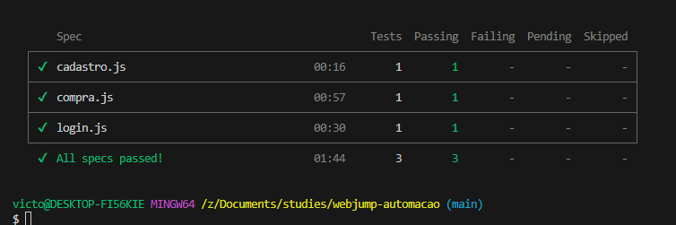

# webjump-automacao
 
Projeto de automação de testes em Cypress para a vaga de Analista de Testes de Software (QA) na Webjump

### Cenários de teste
- Cadastro de usuário
- Login
- Adicionar produto ao carrinho
- Finalização de compra

### Resultado da execução dos testes

### Instalação
- Clonar esse projeto do Github
- Instalar Node.js e npm

### Execução dos testes
- Inserir o comando `npx cypress run` no terminal para executar todos os testes em modo headless
- Inserir o comando `npx cypress open` no terminal para abrir a interface do Cypress e executar as specs
